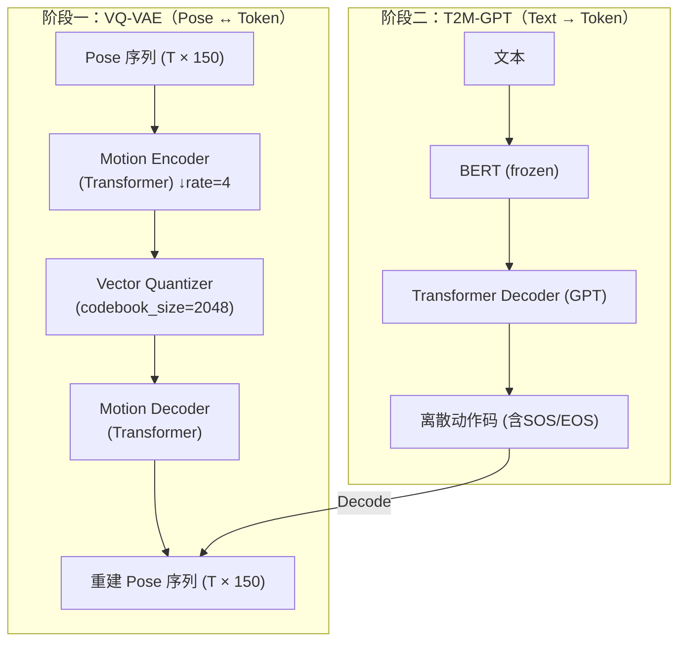

# Text-to-Pose 手语生成系统（VQ‑VAE + GPT）

从自然语言文本生成对应的 2D 手语 pose 序列。系统采用两阶段范式：首先用 VQ‑VAE 将连续姿态序列离散化为“动作码”，再用文本条件的自回归 GPT 生成这些码，最后解码为完整的姿态序列并可视化为 GIF。

## 📋 项目概述

两阶段训练流程：

1. **VQ‑VAE**：学习 pose 序列的时空表示，并量化为离散码（codebook token）；可将离散码解码回 pose 序列。
2. **T2M‑GPT**：冻结文本编码器（BERT），自回归生成离散动作码（含 SOS/EOS），实现文本到动作序列的生成。

## 🏗️ 系统架构



### 核心组件

- **Text Encoder**：BERT（冻结参数）
- **Motion Encoder/Decoder**：Transformer 编解码器 + 下采样/上采样
- **Vector Quantizer**：向量量化器（支持 EMA 更新）
- **Kinematic Decoder（可选）**：基于 2D 骨骼前向运动学的几何一致性解码
- **Sign‑aware Loss**：手部更高权重、骨长一致性与时序平滑正则

## 📊 数据格式

### Pose 数据结构（150 维）
- **身体关键点**：8 个点 × 3 (x, y, confidence) = 24 维
- **右手关键点**：21 个点 × 3 = 63 维
- **左手关键点**：21 个点 × 3 = 63 维
- **面部关键点**：暂未使用（设为 0）

### 数据集目录
```
datasets/ASL_gloss/
├── train/                # 训练数据
├── dev/                  # 验证数据
├── test/                 # 测试数据
└── <split>/<sid>/{text.txt, pose.json}
```

其中 `text.txt` 为文本，`pose.json` 为帧序列，每帧拼接为 150 维（与上面顺序一致）。首次运行会在 `.cache/` 下缓存统计量与采样桶信息。

## 🚀 快速开始

### 1. 安装依赖
```bash
pip install -r requirements.txt
```

### 2. 准备数据
- 在 `src/config.py` 中确认 `self.data_root = "./datasets"`。
- 保证目录结构与文件命名符合“数据集目录”一节。

### 3. 训练 VQ‑VAE（阶段一）
```bash
python 1_train_vqvae.py --wandb --session_epochs 3
```
- 支持断点续训，权重保存至 `./checkpoints/vqvae_model_latest.pth` 与 `./checkpoints/vqvae_model.pth`（best）。

### 4. 训练 T2M‑GPT（阶段二）
```bash
python 2_train_gpt.py --wandb
```
- 依赖 `./checkpoints/vqvae_model.pth`。

### 5. 文本到姿态推理与可视化
```bash
python 3_inference.py \
  --vqvae_checkpoint ./checkpoints/vqvae_model.pth \
  --gpt_checkpoint   ./checkpoints/t2m_gpt_model.pth \
  --text "apple" \
  --output_dir ./outputs
```
输出 GIF 位于 `outputs/`。

## 📁 文件说明

- `src/config.py`：统一配置（模型规模、训练超参、数据根目录等）
- `src/dataloader.py`：数据加载、统计缓存、分桶采样 `BucketSampler`
- `src/model_vqvae.py`：VQ‑VAE（Transformer 编/解码 + 向量量化 + 可选运动学解码与 sign‑aware 损失）
- `src/model_gpt.py`：文本条件 GPT（冻结 BERT + Transformer Decoder，自回归生成动作码）
- `1_train_vqvae.py`：VQ‑VAE 训练脚本（Session 化、自动断点续训、W&B 可选）
- `2_train_gpt.py`：T2M‑GPT 训练脚本（验证与 best/last 权重保存）
- `3_inference.py`：推理与可视化（按 `downsample_rate` 还原帧长）
- `src/asl_visualizer.py`：将姿态序列渲染为 GIF（调色与布局可自定义）

## 🎯 训练细节与特性

- **Codebook**：`codebook_size=2048`，`embedding_dim=384`
- **时间下采样率**：`downsample_rate=4`（token ↔ 帧数之间的映射）
- **Sign‑aware 重建**：手部更高权重、置信度加权、骨长一致性与速度/加速度平滑
- **Windows 友好**：默认 `num_workers=0`, `pin_memory=False` 以避免内存抖动

## 🔧 关键配置（节选）

```python
# src/config.py（节选）
pose_dim = 150
codebook_size = 2048
downsample_rate = 4
vqvae_num_epochs = 120
gpt_num_epochs = 50
text_model_name = "bert-base-uncased"
use_kinematic_decoder = True
```

## 📱 应用场景

- **手语翻译**：文本转手语动作
- **虚拟数字人**：驱动角色进行手语表达
- **辅助交流**：为听障人群提供更直观的沟通方式
- **教育培训**：手语教学与练习评估

## 🔬 扩展方向

1. 更大规模数据与更丰富词汇/句子级生成
2. 运动学与物理先验的更强约束
3. 更优自回归采样（如温度、top‑k、top‑p 动态调度）
4. 3D 骨架与多模态（音频/视频）联合建模

## ⚠️ 注意事项

- 首次运行会自动下载 `bert-base-uncased`（需联网或已有本地缓存）。
- `pose.json` 每帧必须是 150 维拼接，缺帧会使样本跳过。
- `.cache/` 下会缓存统计量与长度分桶以加速训练。

## 🤝 致谢

- OpenPose / MediaPipe（姿态与手部关键点范式）
- VQ‑VAE / Vector Quantization 系列工作
- Transformer / GPT 系列工作

---

**作者**: Chengyao Zhu  
**日期**: 2025年6月  
**许可**: MIT License