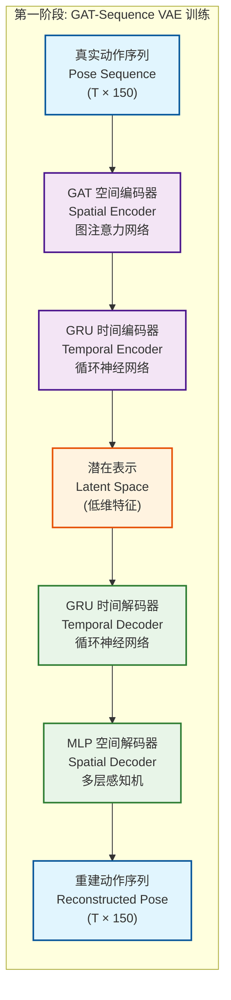

# Text-to-Pose 手语生成系统

基于AnimateDiff训练方式的扩散模型手语生成系统，能够从自然语言文本生成对应的手语pose序列。

## 📋 项目概述

本项目实现了一个完整的text-to-pose训练流程，采用类似AnimateDiff的两阶段训练方式：

1. **Foundation Model**: 训练text-to-pose基础模型（单帧）
2. **Temporal Model**: 基于foundation model添加时序处理能力（多帧序列）

## 🏗️ 系统架构



### 核心组件

- **Text Encoder**: 基于BERT的文本编码器
- **Pose Embedder**: 将150维pose数据嵌入到隐空间
- **Diffusion Scheduler**: 扩散过程的噪声调度
- **Noise Predictor**: 预测噪声的神经网络
- **Temporal Attention**: 处理时序信息的注意力机制
- **Pose Decoder**: 将隐向量解码为pose数据

## 📊 数据格式

### Pose数据结构 (150维)
- **身体关键点**: 8个点 × 3 (x,y,confidence) = 24维
- **左手关键点**: 21个点 × 3 = 63维  
- **右手关键点**: 21个点 × 3 = 63维
- **面部关键点**: 暂未使用 (设为0)

### 数据集结构
```
datasets/ASL_gloss/
├── train/          # 训练数据
├── dev/            # 验证数据  
├── test/           # 测试数据
├── ASL_train_index.json
├── ASL_dev_index.json
└── ASL_test_index.json
```

## 🚀 快速开始

### 1. 环境准备
```bash
pip install -r requirements.txt
```

### 2. 生成演示数据集
```bash
python create_demo_data.py
```

### 3. 训练Foundation Model
```bash
python train_foundation.py
```

### 4. 训练Temporal Model  
```bash
python train_temporal.py
```

### 5. 运行完整演示
```bash
python demo_complete_system.py
```

## 📁 文件说明

### 训练相关
- `train_config.py` - 训练配置参数
- `data_loader.py` - 单帧数据加载器
- `temporal_data_loader.py` - 时序数据加载器
- `model.py` - Foundation模型定义
- `temporal_model.py` - Temporal模型定义

### 训练脚本
- `train_foundation.py` - Foundation模型训练
- `train_temporal.py` - Temporal模型训练
- `test_foundation.py` - Foundation模型测试
- `demo_complete_system.py` - 完整系统演示

### 数据准备
- `create_demo_data.py` - 创建演示数据集

## 🎯 训练流程

### 阶段1: Foundation Model训练

```python
# 单帧pose生成
输入: "hello" (文本)
输出: [150维pose向量] (单帧)

训练目标: 学习text → pose的映射关系
```

### 阶段2: Temporal Model训练

```python
# pose序列生成  
输入: "hello" (文本)
输出: [seq_len, 150] (多帧序列)

训练策略:
- 冻结Foundation Model权重
- 只训练新增的Temporal Layers
- 保持foundation能力的同时添加时序建模
```

## 📈 模型性能

### Foundation Model
- **总参数**: 114,216,598
- **可训练参数**: 4,734,358  
- **功能**: 单帧pose生成

### Temporal Model  
- **总参数**: 117,908,630
- **新增参数**: 3,692,032
- **功能**: 连续pose序列生成

## 🎨 技术特点

1. **扩散模型**: 保证生成质量和多样性
2. **分阶段训练**: 提高训练效率，类似AnimateDiff
3. **时序建模**: 保证动作的时序连贯性
4. **可扩展性**: 易于扩展到更多词汇和动作

## 🔧 关键参数

```python
# 模型配置
pose_dim = 150          # pose维度
text_embed_dim = 512    # 文本嵌入维度
pose_embed_dim = 256    # pose嵌入维度
hidden_dim = 1024       # 隐层维度

# 扩散配置
num_diffusion_steps = 1000
beta_start = 0.0001
beta_end = 0.02

# 训练配置
batch_size = 8
learning_rate = 1e-4
num_epochs = 20
```

## 📱 应用场景

- **手语翻译**: 文本转手语动作
- **虚拟人生成**: 驱动虚拟角色做手语
- **辅助交流**: 帮助聋哑人士交流
- **教育培训**: 手语教学和学习

## 🔬 扩展方向

1. **更大数据集**: 使用真实ASL数据集
2. **更多词汇**: 扩展词汇表和句子级生成
3. **质量提升**: 优化模型架构和训练策略
4. **实时生成**: 优化推理速度
5. **多模态**: 结合音频、视频等信息

## 📜 技术原理

### 扩散模型
采用DDPM (Denoising Diffusion Probabilistic Models)框架：
- **前向过程**: 逐步添加噪声直到变成纯噪声
- **反向过程**: 学习从噪声中恢复数据
- **条件生成**: 基于文本条件生成特定pose

### AnimateDiff启发
- **Foundation先训练**: 建立基础的text-pose映射
- **Temporal后训练**: 在冻结foundation的基础上添加时序能力
- **参数高效**: 避免从头训练大型时序模型

## 🤝 致谢

本项目受到以下工作的启发：
- AnimateDiff: 视频生成的时序扩散模型
- Stable Diffusion: 文本到图像的扩散模型
- OpenPose: 人体姿态估计

---

**作者**: Chengyao Zhu
**日期**: 2025年6月  
**许可**: MIT License 